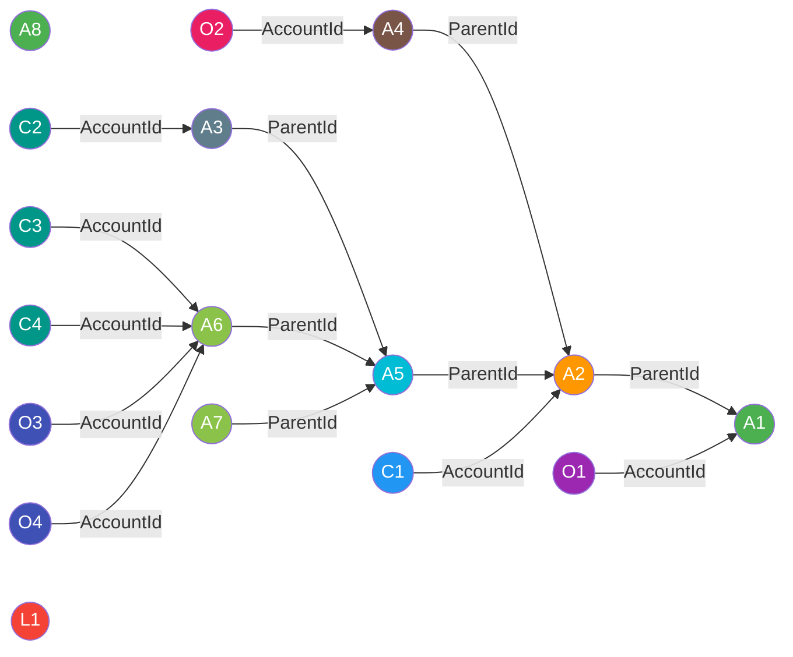

# Registration

## Deduplication Strategy 

When records with the same ID are added to a list and an update is attempted, Salesforce throws the error `System.ListException: Duplicate id in list`.

**Standard DML**

```apex
Account account = [SELECT Id, Name FROM Account LIMIT 1];

List<Account> accountsToUpdate = new List<Account>();

Account account1 = new Account(Id = account.Id, Name = 'New Account 1', Website = 'mywebsite.com');
accountsToUpdate.add(account1);

Account account2 = new Account(Id = account.Id, Name = 'New Account 2');
accountsToUpdate.add(account2);

update accountsToUpdate; // Throws: System.ListException: Duplicate id in list
```

The same behavior applies in DML Lib. By default, an error will be thrown when the same record is registered multiple times.

**DML Lib (Default Behavior)**

```apex
Account account = [SELECT Id, Name FROM Account LIMIT 1];

new DML()
    .toUpdate(new Account(Id = account.Id, Name = 'New Account 1', Website = 'mywebsite.com'))
    .toUpdate(new Account(Id = account.Id, Name = 'New Account 2'))
    .commitWork(); // Throws: Duplicate records found during registration
```

### combineOnDuplicate

Use `combineOnDuplicate()` to automatically merge duplicate registrations into a single record. When the same record ID is registered multiple times, field values from later registrations override earlier ones, while preserving fields that are only set in earlier registrations.

**Signature**

```apex
Commitable combineOnDuplicate();
```

**Example**

```apex
Account account = [SELECT Id, Name FROM Account LIMIT 1];

new DML()
    .combineOnDuplicate()
    .toUpdate(new Account(Id = account.Id, Name = 'New Account 1', Website = 'mywebsite.com'))
    .toUpdate(new Account(Id = account.Id, Name = 'New Account 2'))
    .commitWork();
```

The two records will be merged into one before the DML operation:

| Field | First Registration | Second Registration | Final Value |
|-------|-------------------|---------------------|-------------|
| Id | account.Id | account.Id | account.Id |
| Name | 'New Account 1' | 'New Account 2' | 'New Account 2' |
| Website | 'mywebsite.com' | - | 'mywebsite.com' |

Result: `new Account(Id = account.Id, Name = 'New Account 2', Website = 'mywebsite.com')` will be updated.

## Registration Order

DML Lib uses Kahn's algorithm (topological sort) to resolve dependencies between records and commit them in the correct order. You can register records in any order — DML Lib will automatically determine the proper execution sequence.

**Example**

```apex
Account account = new Account(Name = 'Acme');
Contact contact = new Contact(LastName = 'Smith');
Opportunity opportunity = new Opportunity(Name = 'Deal', StageName = 'New', CloseDate = Date.today());

new DML()
    .toInsert(account)
    .toInsert(DML.Record(contact).withRelationship(Contact.AccountId, account))
    .toInsert(DML.Record(opportunity).withRelationship(Opportunity.AccountId, account))
    .commitWork();
```

## Minimal DMLs

DML Lib minimizes the number of DML statements by building a dependency graph and grouping records into execution buckets.

### How It Works

1. **Graph Construction** - When you register records using `toInsert()`, `toUpdate()`, etc., each record becomes a node in a dependency graph. Relationships defined via `withRelationship()` create edges between nodes.

2. **Dependency Resolution** - Kahn's algorithm (topological sort) processes the graph, ensuring parent records are committed before their dependents.

3. **Bucket Assignment** - During graph resolution, records are grouped into buckets based on their operation characteristics:
   - **Operation type** - INSERT, UPDATE, UPSERT, DELETE, UNDELETE, MERGE, PUBLISH
   - **SObject type** - Account, Contact, Opportunity, etc.
   - **Additional identifiers** - Upsert external ID field, merge master record ID

Records sharing the same characteristics are placed in the same bucket and executed in a single DML statement.

### Example

```apex
new DML()
    .toInsert(account1)
    .toUpsert(DML.Record(account2).withRelationship(Account.ParentId, account1))
    .toUpsert(DML.Record(account4).withRelationship(Account.ParentId, account2))
    .toInsert(DML.Record(account5).withRelationship(Account.ParentId, account2))
    .toUpsert(DML.Record(account3).withRelationship(Account.ParentId, account5))
    .toInsert(DML.Record(account6).withRelationship(Account.ParentId, account5))
    .toInsert(DML.Record(account7).withRelationship(Account.ParentId, account5))
    .toInsert(account8)
    .toInsert(DML.Record(contact1).withRelationship(Contact.AccountId, account2))
    .toInsert(DML.Record(contact2).withRelationship(Contact.AccountId, account3))
    .toInsert(DML.Record(contact3).withRelationship(Contact.AccountId, account6))
    .toInsert(DML.Record(contact4).withRelationship(Contact.AccountId, account6))
    .toInsert(DML.Record(opportunity1).withRelationship(Opportunity.AccountId, account1))
    .toInsert(DML.Record(opportunity2).withRelationship(Opportunity.AccountId, account4))
    .toInsert(DML.Record(opportunity3).withRelationship(Opportunity.AccountId, account6))
    .toInsert(DML.Record(opportunity4).withRelationship(Opportunity.AccountId, account6))
    .toInsert(lead1)
    .commitWork();

// Result: 12 DML statements executed
```

**Dependency Graph**



Despite registering 17 records, only **12 DML statements** are executed:

| DML # | Operation | SObject | Records | Reason |
|-------|-----------|---------|---------|--------|
| <span style="display:inline-block;width:12px;height:12px;background:#4CAF50;border-radius:2px"></span> 1 | INSERT | Account | account1, account8 | No dependencies, same bucket |
| <span style="display:inline-block;width:12px;height:12px;background:#F44336;border-radius:2px"></span> 2 | INSERT | Lead | lead1 | No dependencies |
| <span style="display:inline-block;width:12px;height:12px;background:#FF9800;border-radius:2px"></span> 3 | UPSERT | Account | account2 | Depends on account1 (ParentId) |
| <span style="display:inline-block;width:12px;height:12px;background:#9C27B0;border-radius:2px"></span> 4 | INSERT | Opportunity | opportunity1 | Depends on account1 (AccountId) |
| <span style="display:inline-block;width:12px;height:12px;background:#795548;border-radius:2px"></span> 5 | UPSERT | Account | account4 | Depends on account2 (ParentId) |
| <span style="display:inline-block;width:12px;height:12px;background:#00BCD4;border-radius:2px"></span> 6 | INSERT | Account | account5 | Depends on account2 (ParentId) |
| <span style="display:inline-block;width:12px;height:12px;background:#2196F3;border-radius:2px"></span> 7 | INSERT | Contact | contact1 | Depends on account2 (AccountId) |
| <span style="display:inline-block;width:12px;height:12px;background:#607D8B;border-radius:2px"></span> 8 | UPSERT | Account | account3 | Depends on account5 (ParentId) |
| <span style="display:inline-block;width:12px;height:12px;background:#8BC34A;border-radius:2px"></span> 9 | INSERT | Account | account6, account7 | Depend on account5 (ParentId), same bucket |
| <span style="display:inline-block;width:12px;height:12px;background:#E91E63;border-radius:2px"></span> 10 | INSERT | Opportunity | opportunity2 | Depends on account4 (AccountId) |
| <span style="display:inline-block;width:12px;height:12px;background:#009688;border-radius:2px"></span> 11 | INSERT | Contact | contact2, contact3, contact4 | Depend on account3 and account6, same bucket |
| <span style="display:inline-block;width:12px;height:12px;background:#3F51B5;border-radius:2px"></span> 12 | INSERT | Opportunity | opportunity3, opportunity4 | Depend on account6 (AccountId), same bucket |

::: tip
No matter how you register records - in any order, across multiple method calls, or with complex relationships - DML Lib guarantees the minimal number of DML statements while respecting all dependencies.
:::