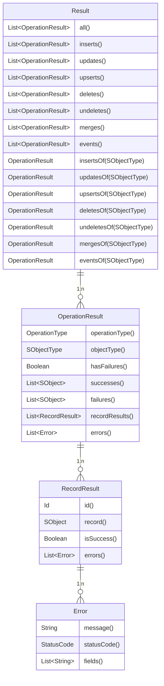

# Result

The DML library provides comprehensive result handling through the [`Result`](#result-interface), [`OperationResult`](#operationresult-interface), [`RecordResult`](#recordresult-interface), and [`Error`](#error-interface) interfaces. These allow you to inspect the outcome of DML operations, including success/failure status, record IDs, and error details.

## Overview

When you call `commitWork()`, `commitTransaction()` or `dryRun()`, a `Result` object is returned containing detailed information about each DML operation performed.

::: info
`Result` is returned only when **no errors occur** or `allowPartialSuccess()` is enabled. Otherwise, a `DmlException` will be thrown, which mimcs standard DML behaviour.
:::

```apex
DML.Result result = new DML()
    .toInsert(account)
    .toUpdate(contact)
    .commitWork();

// Check results by operation type
List<DML.OperationResult> insertResults = result.inserts();
List<DML.OperationResult> updateResults = result.updates();

// Check results by SObject type
DML.OperationResult accountInserts = result.insertsOf(Account.SObjectType);
```



## Result Interface

The `Result` interface provides methods to access operation results.

### Get All Results

**Signature**

```apex
List<OperationResult> all();
```

**Example**

```apex
DML.Result result = new DML()
    .toInsert(accounts)
    .toUpdate(contacts)
    .commitWork();

for (DML.OperationResult operationResult : result.all()) {
    System.debug('Operation: ' + operationResult.operationType());
    System.debug('Object: ' + operationResult.objectType());
    System.debug('Has Failures: ' + operationResult.hasFailures());
}
```

### Get Results by Operation Type

**Signatures**

```apex
List<OperationResult> inserts();
List<OperationResult> updates();
List<OperationResult> upserts();
List<OperationResult> deletes();
List<OperationResult> undeletes();
List<OperationResult> events();
```

**Example**

```apex
DML.Result result = new DML()
    .toInsert(accounts)
    .toInsert(contacts)
    .commitWork();

// Get all insert results (one per SObject type)
List<DML.OperationResult> insertResults = result.inserts();

Assert.areEqual(2, insertResults.size()); // Account and Contact
```

### Get Results by SObject Type

**Signatures**

```apex
OperationResult insertsOf(Schema.SObjectType objectType);
OperationResult updatesOf(Schema.SObjectType objectType);
OperationResult upsertsOf(Schema.SObjectType objectType);
OperationResult deletesOf(Schema.SObjectType objectType);
OperationResult undeletesOf(Schema.SObjectType objectType);
OperationResult eventsOf(Schema.SObjectType objectType);
```

**Example**

```apex
DML.Result result = new DML()
    .toInsert(accounts)
    .toInsert(contacts)
    .commitWork();

// Get insert results for Accounts only
DML.OperationResult accountResults = result.insertsOf(Account.SObjectType);
DML.OperationResult contactResults = result.insertsOf(Contact.SObjectType);
```

## OperationResult Interface

The `OperationResult` interface provides detailed information about a specific DML operation.

### Methods

**Signatures**

```apex
OperationType operationType();      // DML operation type (INSERT_DML, UPDATE_DML, etc.)
Schema.SObjectType objectType();    // SObject type for this operation
Boolean hasFailures();              // True if any records failed
List<Error> errors();               // All errors from failed records
List<SObject> records();            // All records that were processed
List<SObject> successes();          // Records that succeeded
List<SObject> failures();           // Records that failed
List<RecordResult> recordResults(); // Individual record results
```

**Example**

```apex
DML.Result result = new DML()
    .toInsert(accounts)
    .commitWork();

DML.OperationResult operationResult = result.insertsOf(Account.SObjectType);

// Operation metadata
Assert.areEqual(DML.OperationType.INSERT_DML, operationResult.operationType());
Assert.areEqual(Account.SObjectType, operationResult.objectType());

// Check for failures
if (operationResult.hasFailures()) {
    List<SObject> failedRecords = operationResult.failures();
    List<DML.Error> allErrors = operationResult.errors();
}

// Get successful records
List<SObject> successfulRecords = operationResult.successes();
```

## RecordResult Interface

The `RecordResult` interface provides information about individual record processing.

### Methods

**Signatures**

```apex
Id id();                  // Record ID (assigned after insert)
SObject record();         // The actual SObject record
Boolean isSuccess();      // True if this record succeeded
List<Error> errors();     // List of errors for this record
```

**Example**

```apex
DML.Result result = new DML()
    .toInsert(accounts)
    .allowPartialSuccess()
    .commitWork();

DML.OperationResult operationResult = result.insertsOf(Account.SObjectType);

for (DML.RecordResult recordResult : operationResult.recordResults()) {
    if (recordResult.isSuccess()) {
        System.debug('Record inserted with Id: ' + recordResult.id());
        System.debug('Record: ' + recordResult.record());
    } else {
        System.debug('Record failed:');
        for (DML.Error error : recordResult.errors()) {
            System.debug('  - ' + error.message());
        }
    }
}
```

## Error Interface

The `Error` interface provides details about DML errors.

### Methods

**Signatures**

```apex
String message();               // Error message
System.StatusCode statusCode(); // Status code (e.g., REQUIRED_FIELD_MISSING)
List<String> fields();          // Fields that caused the error
```

**Example**

```apex
DML.Result result = new DML()
    .toInsert(accounts)
    .allowPartialSuccess()
    .commitWork();

for (DML.OperationResult operationResult : result.all()) {
    for (DML.Error error : operationResult.errors()) {
        System.debug('Error Message: ' + error.message());
        System.debug('Status Code: ' + error.statusCode());
        System.debug('Fields: ' + error.fields());
    }
}
```

## OperationType Enum

The `DML.OperationType` enum identifies the type of DML operation.

**Values**

```apex
DML.OperationType.INSERT_DML
DML.OperationType.UPDATE_DML
DML.OperationType.UPSERT_DML
DML.OperationType.DELETE_DML
DML.OperationType.UNDELETE_DML
DML.OperationType.PUBLISH_DML
```

## Complete Examples

### Basic Insert with Result

```apex
Account account = new Account(Name = 'Test Account');

DML.Result result = new DML()
    .toInsert(account)
    .commitWork();

// Verify result
Assert.areEqual(1, result.inserts().size());

DML.OperationResult operationResult = result.insertsOf(Account.SObjectType);
Assert.areEqual(1, operationResult.records().size());
Assert.areEqual(1, operationResult.successes().size());
Assert.areEqual(0, operationResult.failures().size());
Assert.isFalse(operationResult.hasFailures());
Assert.areEqual(DML.OperationType.INSERT_DML, operationResult.operationType());
Assert.areEqual(Account.SObjectType, operationResult.objectType());

// Check record result
DML.RecordResult recordResult = operationResult.recordResults()[0];
Assert.isTrue(recordResult.isSuccess());
Assert.isNotNull(recordResult.id());
Assert.areEqual(account.Id, recordResult.id());
```

### Partial Success Handling

```apex
List<Account> accounts = new List<Account>{
    new Account(Name = 'Valid Account 1'),
    new Account(), // Missing required Name
    new Account(Name = 'Valid Account 2')
};

DML.Result result = new DML()
    .toInsert(accounts)
    .allowPartialSuccess()
    .commitWork();

DML.OperationResult operationResult = result.insertsOf(Account.SObjectType);

// Check counts
Assert.areEqual(3, operationResult.records().size());
Assert.areEqual(2, operationResult.successes().size());
Assert.areEqual(1, operationResult.failures().size());
Assert.isTrue(operationResult.hasFailures());

// Process individual results
for (DML.RecordResult rr : operationResult.recordResults()) {
    if (rr.isSuccess()) {
        System.debug('Record succeeded with Id: ' + rr.id());
    } else {
        System.debug('Record failed:');
        for (DML.Error error : rr.errors()) {
            System.debug('  Status: ' + error.statusCode());
            System.debug('  Message: ' + error.message());
            System.debug('  Fields: ' + error.fields());
        }
    }
}
```

### Multiple Operation Types

```apex
Account account = new Account(Name = 'New Account');
Contact existingContact = [SELECT Id, FirstName FROM Contact LIMIT 1];
existingContact.FirstName = 'Updated';
Lead leadToDelete = [SELECT Id FROM Lead LIMIT 1];

DML.Result result = new DML()
    .toInsert(account)
    .toUpdate(existingContact)
    .toDelete(leadToDelete)
    .commitWork();

// Check each operation type
Assert.areEqual(1, result.inserts().size());
Assert.areEqual(1, result.updates().size());
Assert.areEqual(1, result.deletes().size());

// Verify specific results
Assert.isFalse(result.insertsOf(Account.SObjectType).hasFailures());
Assert.isFalse(result.updatesOf(Contact.SObjectType).hasFailures());
Assert.isFalse(result.deletesOf(Lead.SObjectType).hasFailures());
```

### Multiple SObject Types Same Operation

```apex
Account account = new Account(Name = 'Test Account');
Contact contact = new Contact(FirstName = 'Test', LastName = 'Contact');
Lead lead = new Lead(FirstName = 'Test', LastName = 'Lead', Company = 'Test Co');

DML.Result result = new DML()
    .toInsert(account)
    .toInsert(contact)
    .toInsert(lead)
    .commitWork();

// Get all insert results (3 - one per SObject type)
List<DML.OperationResult> insertResults = result.inserts();
Assert.areEqual(3, insertResults.size());

// Get specific SObject type results
Assert.areEqual(1, result.insertsOf(Account.SObjectType).records().size());
Assert.areEqual(1, result.insertsOf(Contact.SObjectType).records().size());
Assert.areEqual(1, result.insertsOf(Lead.SObjectType).records().size());
```

### Dry Run Results

```apex
Account account = new Account(Name = 'Test Account');

DML.Result result = new DML()
    .toInsert(account)
    .dryRun();

// Result is returned but database is rolled back
Assert.areEqual(1, result.inserts().size());
Assert.isFalse(result.insertsOf(Account.SObjectType).hasFailures());

// No records in database
Assert.areEqual(0, [SELECT COUNT() FROM Account WHERE Name = 'Test Account']);
```

### Accessing Records from Results

```apex
List<Account> accounts = new List<Account>{
    new Account(Name = 'Account 1'),
    new Account(Name = 'Account 2'),
    new Account(Name = 'Account 3')
};

DML.Result result = new DML()
    .toInsert(accounts)
    .commitWork();

// Get the records that were processed
List<SObject> processedRecords = result.insertsOf(Account.SObjectType).records();

// They're the same references, so IDs are populated
Assert.areEqual(3, processedRecords.size());
for (SObject record : processedRecords) {
    Assert.isNotNull(record.Id);
}

// Get only successful records
List<SObject> successfulRecords = result.insertsOf(Account.SObjectType).successes();
```

## Best Practices

### Always Check for Failures

```apex
DML.Result result = new DML()
    .toInsert(records)
    .allowPartialSuccess()
    .commitWork();

for (DML.OperationResult operationResult : result.all()) {
    if (operationResult.hasFailures()) {
        // Handle failures appropriately
        for (DML.Error error : operationResult.errors()) {
            System.debug('Error: ' + error.message());
        }
    }
}
```

### Use Results for Verification in Tests

```apex
@IsTest
static void testAccountCreation() {
    Account account = new Account(Name = 'Test');
    
    DML.Result result = new DML()
        .toInsert(account)
        .commitWork();
    
    // Use result for comprehensive assertions
    DML.OperationResult operationResult = result.insertsOf(Account.SObjectType);
    
    Assert.areEqual(1, operationResult.records().size());
    Assert.areEqual(1, operationResult.successes().size());
    Assert.areEqual(0, operationResult.failures().size());
    Assert.isFalse(operationResult.hasFailures());
    Assert.areEqual(DML.OperationType.INSERT_DML, operationResult.operationType());
    Assert.isNotNull(operationResult.recordResults()[0].id());
}
```
